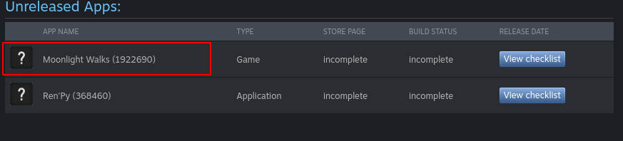
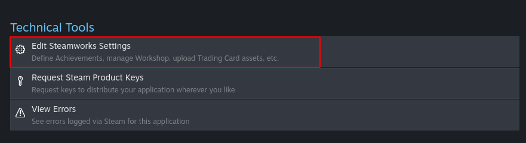
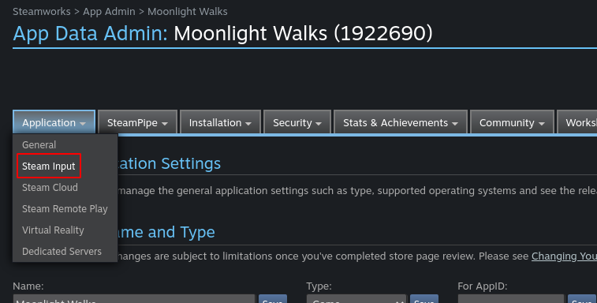
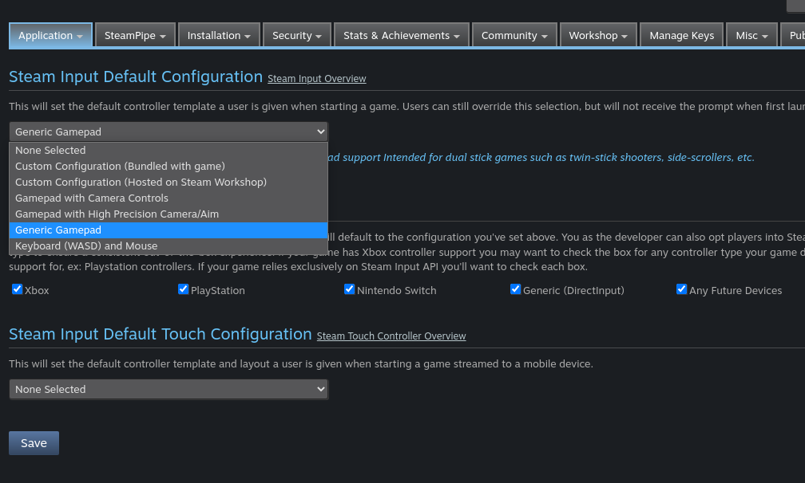
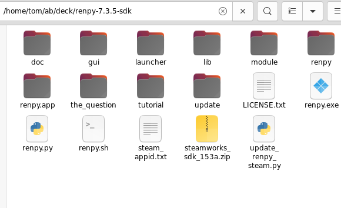

**This is currently a draft. It might be incorrect, or it might be correct and
give bad advice. Here be dragons.**

==============================
Ren'Py on Steam Deck - A Guide
==============================

The goal of this document is to try to help Ren'Py games pass Steam Deck
compatibility review, and gain "Great on Deck" status, with a minimum amount
of effort from the game's developer.

This isn't a complete guide to getting on Steam itself. There's a very good
document, `Ren’Py Visual Novels on Steam: A Step-by-Step Guide <https://bit.ly/2VOH4vf>`_ by
Bob Conway (bobcgames) that covers this process, that I won't repeat here.

This also isn't a direct substitute for Valve's `Steam Deck documentation <https://partner.steamgames.com/doc/steamdeck>`_,
especially the sections on `How to load and run games on Steam Deck <https://partner.steamgames.com/doc/steamdeck/loadgames>`_ and
the `Steam Deck Compatibility Review Process <https://partner.steamgames.com/doc/steamdeck/compat>`_.

Rather, this is a discussion about how to make sure a Ren'Py game runs on Steam
Deck and satisifies those guidelines. Where possible, I want to try to get the
game running  with minimal changes, though some games will require a re-release.

Linux Build
===========

The Steam Deck is running a build of Linux. Ren'Py is developed on Linux, and
Ren'Py runs well on Linux. It makes a lot of sense to uploade a SteamOS + Linux
build of your game, and make sure that's the build that's submitted for
compatibility testing.

I've seen some problem when running a Windows build through Steam Play and
Proton, and while it may work most of the time, having an unnecessary translation
layer isn't likely to help.

Controller Support
==================

The first requirement is that "Your game must support Steam Deck's physical
controls. The default controller configuration must provide users with the
ability to access all content. Players must not need to adjust any in-game settings
in order to enable controller support or this configuration."

Recommended Controller Mapping
-------------------------------

Since Ren'Py 6.99.6, Ren'Py games include native controller support for the
Xinput-style controller that is emulated by the Steam Input system. The
default mapping of the controls is:

Right Trigger, A
    Dismiss dialogue, select buttons and bars.

Y
    Hide the interface.

Left Shoulder, Left Trigger, Back
    Perform a rollback.

Right Shoulder
    Perform a roll-forward.

Menu/Start
    Enter and exit the game menu.

Left Dpad, Left Stick, Right stick.
    Navigate through the game's interface.

In addition to this, on the Steam Deck, it's suggested that the right touchpad
move the mouse around the screen, and pressing the right touchpad causes a click
to occur.

I'd suggest most games try to map their controllers in this manner, as consitency
will help players adapt to new games.

Ren'Py 6.99.6 and Higher
-------------------------

Since Ren'Py 6.99.6, Ren'Py has had built-in support for controllers, and
that support should work well with Steam Deck, and especially the "Generic Gamepad"
controller configuration. To set this, visit `your dashboard <https://partner.steamgames.com/dashboard>`_,
choose your game:

Then navigate to "Edit SteamWorks Settings":

And finally, navigate to "Applications", "Steam Input".

You can then opt into the "Generic Gamepad" configuration, make sure all kinds
of controllers are opted into Steam Input.

When you select "Save", your game should now support generic gamepad input.

**Valve: Do they have to publish after saving?**

Ren'Py 6.99.5 and Lower
-----------------------

**Valve: How do I get the URL for a controller configuration that I created on te deck? Can it be shared between apps?**

Older Ren'Py games don't support the controller input. However, controller
support is very similar to the way Ren'Py navigates games using the keyboard,
and so it's possible to use Steam Input to map the Steam Deck's input to
the keyboard, allowing the game to be accessed.

Then navigate to "Edit SteamWorks Settings":

And finally, navigate to "Applications", "Steam Input".

For the default configuration, choose "Custom Configuraton (Hosted on Steam Workshop)",
then "Add Custom Configuration", and then enter in the URL for the configuration.

When you select "Save", your game should now support mapping the gamepad input to
the keyboard.

Keyboard Support
=================

Another requirement is that "If your game requires text input (eg., for naming a
character or a save file), you must either use a Steamworks API for text entry
to open the on-screen keyboard for players using a controller, or have your
own built-in entry that allows users to enter text in their language using only
a controller."

**Many games will trivially satisfy this requirement, by not requiring text
input.** In that case, great - you can ignore the rest of ths section.

If your game requires keyboard input - perhaps it prompts for the main character's
name, what you need to do depends on the version of Ren'Py that you are running.

Ren'Py 7.5.0 or Later
---------------------

(Note that this version is not released at the time of the writing of this
document.)

New versions of Ren'Py include built-in support for managing the Steam Deck
keyboard. Ren'Py will automatically determine if the floating keyboard needs
to be show, and if text input is required, Ren'Py will show the keyboard.
When text input ends, Ren'Py will shift down the keyboard.

There are a few variables that can be set to customize this
process. These live in the _renpysteam namespace, which is the module that
implements them.

\_renpysteam.keyboard\_mode = "always"
    This should be one of "always", "once", and "never".

    * "always" means the keyboard is always show when text input is requested.
    * "once" means the keyboard is shown once per interaction. If the keyboard is hidden, it will not be automatically re-show. (It can be shown again with Steam+X.)
    * "never" means the keyboard should not be automatically managed.

\_renpysteam.keyboard\_shift = True
    If True, interface layers (by default "screens", "transient", and "overlay")
    are shifted upwards so the input text is visible to the user. The input text is shifted
    up so that its baseline is aligned with \_renpysteam.text\_baseline. Input text is
    never shifted down.

\_renpysteam.keyboard\_baseline = 0.5
    This is the baseline that input text is shifted to.

These can be set with the define statement::

    define _renpysteam.keyboard_shift = False

Ren'Py 7.4.11 or Earlier
------------------------

To use the floating keyboard with Ren'Py 7.4.11 or earlier, it's necessary
to upgrade Ren'Py's steam support to the version included in Ren'Py 7.5.
This upgraded has been tested to work with Ren'Py 7.3.5 and 7.4.11, and will
likely work with some but not all older versions.

The upgrade may be performed on a Ren'Py SDK or an unpacked Ren'Py game
distribution. For the purpose of these instructions, the base directory
is the directory with the renpy.sh or gamename.sh file in it.

* Install any version of `Python 3 <https://www.python.org/downloads/>`_ on your computer.
* Download `update_renpy_steam.py <https://raw.githubusercontent.com/renpy/steam-deck-guide/main/update_renpy_steam.py>`_ and place it into the  base directory.
* Download the latest Steamworks SDK zip file from `Steamworks <https://partner.steamgames.com/dashboard>`_, and place it into the base directory.

The Steamworks SDK should have a filename like steamworks_sdk_153a.zip. When
ready, your base directory will look like:

You'll then want to run update_renpy_steam.py. Make sure you run in in Python,
not open it in a text editor - you may need to right click and open with
Python to be sure of this. When this script completes without errors, your
game or the SDK is updated. You should delete steamworks_sdk_153a.zip and update_renpy_steam.py so these
files won't be distributed.

After this step, you have the same Steam support that's included in Ren'Py
7.5.0 and later, with support for the floating keyboard.

Variant
=======

When the Steam support is at the 7.5.0 version (or upgraded as described
above), Ren'Py will define a "steam_deck" `screen variant <https://www.renpy.org/doc/html/screens.html#screen-variants>`_ when the Steam Deck
hardware is detected.

This can be used to select alternate screens, or checked with the renpy.variant
function::

    screen test():

        vbox:

            text "Something common."

            if renpy.variant("steam_deck"):
                text "On Steam Deck."
            else:
                text "On other platform."

Other Requirements
==================

Be sure to check `valve's page <https://partner.steamgames.com/doc/steamdeck/compat>`_ to make
sure these requirements haven't been updated.

Controller Glyphs
-----------------

"When using Steam Deck's physical controls, on-screen glyphs must either match
Deck button names, or match Xbox 360/One button names. Mouse and keyboard
glyphs should not be shown if they are not the active input. Interacting
with any physical Deck controls using the default configuration must not
show non-controller glyphs."

Ren'Py does not display glyphs by default, so this requirement is trivially
satisifed. If your game displays glyphs, it will have to be changed to make
sure the correct glyphs are displayed, perhaps using screen variants.

Resolution Support
------------------

"The game must run at a resolution supported by Steam Deck."

All modern Ren'Py games adjust to the size of the window the game is
displayed in.

Default Configuration
---------------------

"The game must ship with a default configuration on Deck that results in a
playable framerate."

The Steam Deck hardware is fairly powerful, so this is unlikely to be a
problem. Please let the reviewers know that Ren'Py may vary the framerate,
lowering it to save power on static scenes.

Text Legibility
----------------

"interface text must be easily readable at a distance of 12 inches/30 cm from the screen.
 In other words, the smallest on-screen font character should never fall below 9 pixels
 in height at 1280x800."

Ren'Py's default text is around 22px high at 1280x720, and text scales with
window size. There should be ample margin for size changes.

It may make sense for some games to activate the small variant, meant for mobile
devices, when on a Steam Deck, using:::

    init python:
        if renpy.variant("steam_deck"):
            config.variants.remove("large")
            config.variants.insert(0, "small")

This could be the case if the game wants to re-use a moble UI on Steam Deck.

No Device Compatibility Warnings
--------------------------------

"the app must not present the user with information that the Deck software
(ie., specific Linux distribution) or hardware (ie., GPU) is unsupported."

Ren'Py doesn't perform such checks.

Launchers
---------

"For games with launchers, those launchers also must meet the requirements listed here"

Ren'Py games do not require a launcher to run.

Troubleshooting
===============

Typed text shows up as '1's.
----------------------------

This seems to be a problem with Ren'Py and Steam Play. It's suggested to create
a Steam OS + Linux build to ensure that input functions without a translation
layer.
